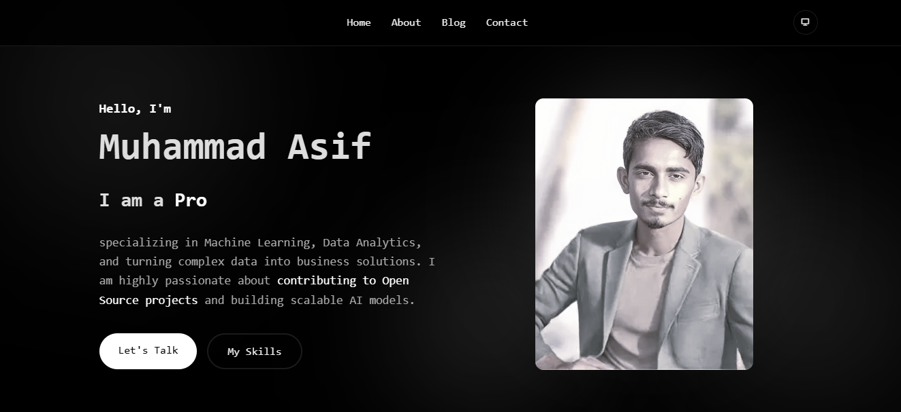

# Personal Portfolio



A professional, responsive, and interactive portfolio website designed for a Data Scientist, Machine Learning Engineer, and Open Source Contributor. This project features a modern Glassmorphism UI, a working contact form, and dynamic theme switching with personalized imagery.

##  Features

- **Dynamic Theme Switching:** 
  - Toggle between **Light**, **Dark**, and **System** modes.
  - Automatically switches profile images based on the active theme (Colorful for Light, B&W for Dark).
- **Interactive UI:**
  - **Glassmorphism Design:** Frosted glass effects for a modern look.
  - **Typewriter Effect:** Dynamic text animation in the hero section.
  - **Animations:** Smooth scroll reveals using `AOS` (Animate On Scroll).
- **Functional Contact Form:** Integrated with **EmailJS** to send messages directly to your email without a backend server.
- **Skills Showcase:** Interactive cards with tooltips for technical skills (Python, TensorFlow, Git, etc.).
- **Responsive Design:** Fully optimized for Mobile, Tablet, and Desktop devices.

##  Tech Stack

- **Frontend:** HTML5, CSS3, JavaScript (Vanilla)
- **Icons:** [Remix Icon](https://remixicon.com/), [Devicon](https://devicon.dev/)
- **Animations:** [AOS Library](https://michalsnik.github.io/aos/)
- **Email Service:** [EmailJS](https://www.emailjs.com/)


## 📂 Project Structure

```
Portfolio/
├── assets/
│   ├── css/
│   │   └── style.css       # Styling and Theme variables
│   ├── js/
│   │   └── script.js       # Logic for Theme, EmailJS, Typescript effect
│   └── images/             # Profile images and assets
│       ├── image.png       # Dark theme profile image (B&W)
│       └── image1.png      # Light theme profile image (Colorful)
├── index.html              # Main structure
├── README.md               # Project documentation
├── LICENCE.md              # License information
└── CONTRIBUTING.md         # Guidelines for contributors
```

## ⚙️ Setup & Customization

1.  **Clone the Repository**
    ```bash
    git clone https://github.com/yourusername/portfolio.git
    ```

2.  **Configure EmailJS**
    - Sign up at [EmailJS](https://www.emailjs.com/).
    - Create a Service and a Template.
    - Open `assets/js/script.js` and replace the keys:
        - `YOUR_PUBLIC_KEY`
        - `YOUR_SERVICE_ID`
        - `YOUR_TEMPLATE_ID`
    *(Note: The current keys in `script.js` are configured and ready to go for the owner).*

3.  **Update Images**
    - Replace the images in the `assets/images/` folder with your own photos.
    - Ensure filenames match or update the `src` paths in `index.html`.

4.  **Edit Content**
    - Update `index.html` with your own bio, links, and blog posts.

##  Contributing

Contributions, issues, and feature requests are welcome!  
Feel free to check the [issues page](https://github.com/muhammad-ais10/muhammad-asif/issues).  
For major changes, please open an issue first to discuss what you would like to change.

Please read the [CONTRIBUTING.md](CONTRIBUTING.md) for details.

##  License

This project is [MIT](LICENCE.md) licensed.

---
Built with 💗 by **Muhammad Asif**
